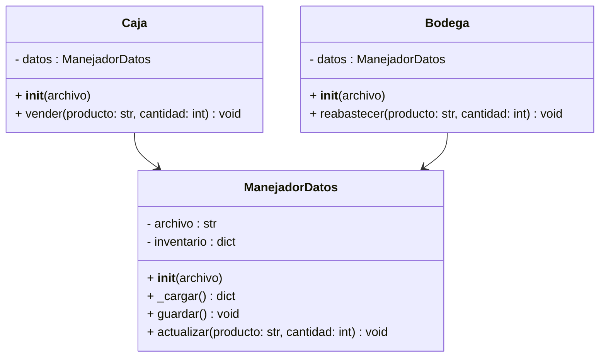
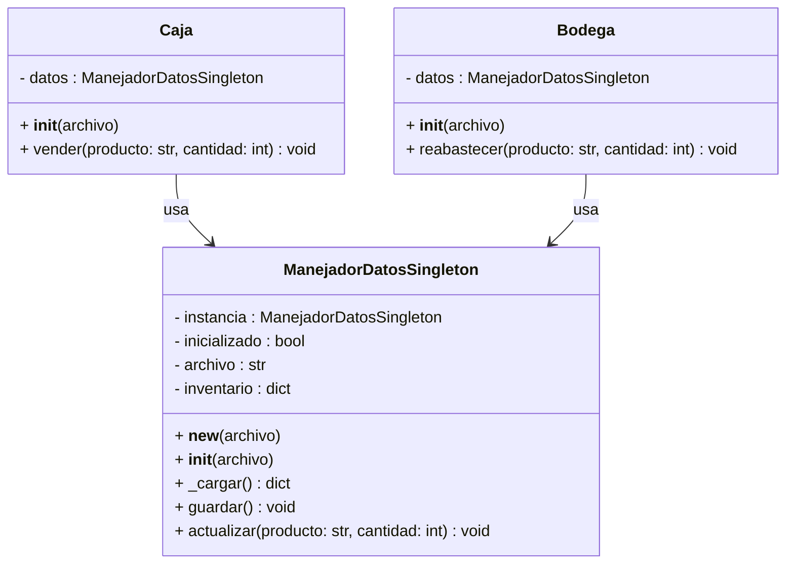

# Mal ejemplo:

```mermaid
classDiagram
    class ManejadorDatos {
        - archivo : str
        - inventario : dict
        + __init__(archivo)
        + _cargar() dict
        + guardar() void
        + actualizar(producto: str, cantidad: int) void
    }

    class Caja {
        - datos : ManejadorDatos
        + __init__(archivo)
        + vender(producto: str, cantidad: int) void
    }

    class Bodega {
        - datos : ManejadorDatos
        + __init__(archivo)
        + reabastecer(producto: str, cantidad: int) void
    }

    Caja --> ManejadorDatos
    Bodega --> ManejadorDatos

```

CSV:
pan,10
leche,5
huevos,18
chocolate,5

# Ejemplo con Singleton

```mermaid
classDiagram
    class ManejadorDatosSingleton {
        - instancia : ManejadorDatosSingleton
        - inicializado : bool
        - archivo : str
        - inventario : dict
        + __new__(archivo)
        + __init__(archivo)
        + _cargar() dict
        + guardar() void
        + actualizar(producto: str, cantidad: int) void
    }

    class Caja {
        - datos : ManejadorDatosSingleton
        + __init__(archivo)
        + vender(producto: str, cantidad: int) void
    }

    class Bodega {
        - datos : ManejadorDatosSingleton
        + __init__(archivo)
        + reabastecer(producto: str, cantidad: int) void
    }

    Caja --> ManejadorDatosSingleton : usa
    Bodega --> ManejadorDatosSingleton : usa

```